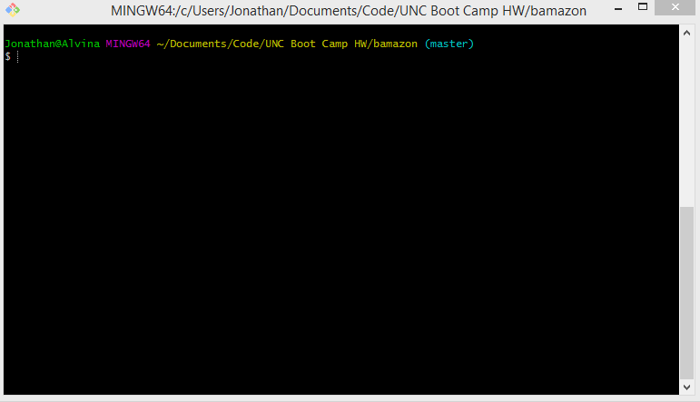

# Bamazon
Welcome to Bamazon, a Node based app using inquirer and MySQL to create a DB connected storefront in your terminal. The following is a GIF example of the app in action. 
* To run this application you will need to run the seed/schema file in MySQL and alter the connection infoto your own specifications and do "npm install" in the directory.
* Once your have executed the seed, you can type "node bamazonCustomer.js" to run the code from the console. It will ask for your input on item and quantity, then return your price. Executing the command again will show updated values for the sql database. 

 

</img>
